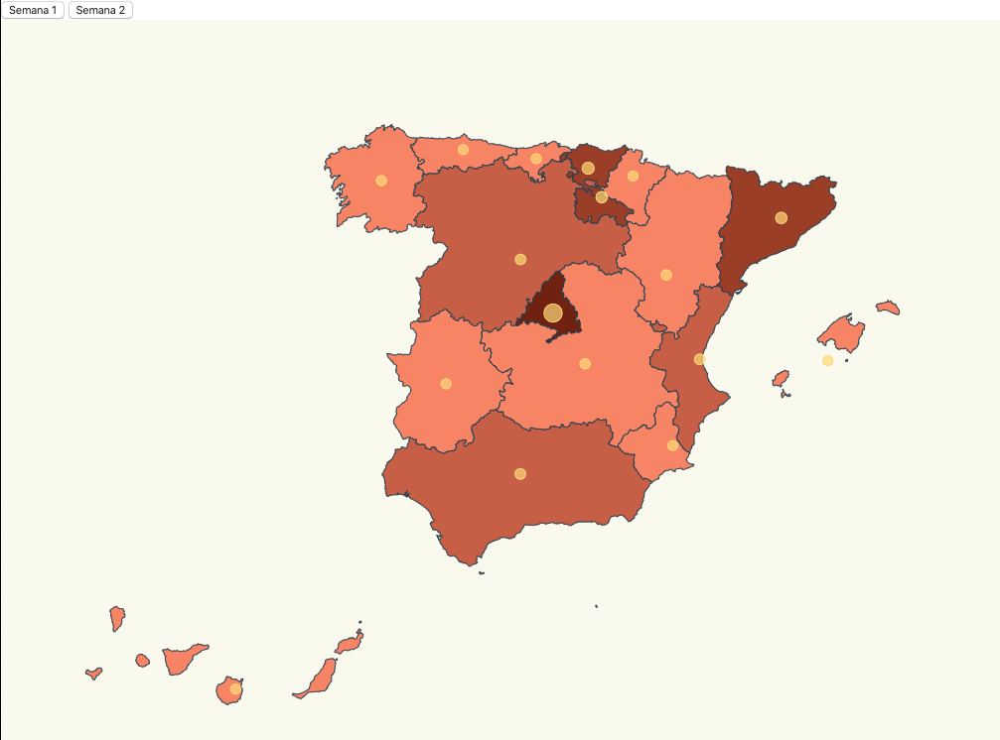

# Advanced Task

- In this task let´s start from Mandatory Task and I will provide a range of color depending the number of affected people in Spain and foremost from every community. You will be able to see the difference of affected people between week 1 and week 2.


- Would you like to create a chart like this ? 




- First let´s import all the libraries I will need in index, all of them are the same, we add d3Composite : 

_./src/index.ts_

```diff
import * as d3 from "d3";
import * as topojson from "topojson-client";
const spainjson = require("./spain.json");
import { latLongCommunities } from "./communities";
import { stats, new_stats, ResultEntry } from "./stats";
+ const d3Composite = require("d3-composite-projections");
```


- Lets create the range of color for the number of affected people depending the number and the autonomous community : 

_./src/index.ts_

```typescript
var color = d3
  .scaleThreshold<number, string>()
  .domain([0, 10, 50, 200, 500, 1000])
  .range([
    "#FFE8E5",
    "#F88F70",
    "#CD6A4E",
    "#A4472D",
    "#7B240E",
    "#540000"
  ]);
```

- Lets change the projection as we already do the mandatory task with d3, now let´s try with d3Composite : 

_./src/index.ts_

```typescript
const aProjection = d3Composite
  .geoConicConformalSpain()
  // Let's make the map bigger to fit in our resolution
  .scale(3300)
  // Let's center the map
  .translate([500, 400]);
```

- Lets create the geojson and geopath with new data : 

_./src/index.ts_

```typescript
const geoPath = d3.geoPath().projection(aProjection);
const geojson = topojson.feature(
  spainjson,
  spainjson.objects.ESP_adm1
);
```


- Lets do the radius depending the coronavirus affected people as I did in mandatory task : 

_./src/index.ts_

```typescript
const radiusDependingCVCases = (comunidad: string, data: ResultEntry[]) => {
  const entry = data.find(item => item.name === comunidad);
  const maxAffected = 5000;


  const affectedRadiusScale = d3
    .scaleLinear()
    .domain([0, maxAffected])
    .range([5, 40])
    .clamp(true);
    

  return entry ? affectedRadiusScale(entry.value) : 0;
};
```


- Lets create the new function when the user click  : 

_./src/index.ts_

```diff
document
  .getElementById("stats")
  .addEventListener("click", function handleStats() {
+    updateStats(stats);
+    updateColor(stats);
  });

document
  .getElementById("new_stats")
  .addEventListener("click", function handleNewStats() {
+    updateStats(new_stats);
+    updateColor(new_stats);
  });
```


- Lets create the function that it is updating the color the map and inside the function it is assigning the colour depending the number  : 

_./src/index.ts_

```typescript
const updateColor = (data: ResultEntry[]) => {
  const assignCountryBackgroundColor = (community: string) => {
    const item = data.find(

      item => item.name === community
    );
    if (item) {
      console.log(item.value);
    }

    return item ? color(item.value) : color(0);
  };
```


- Lets create the constant countriespath that will show the different communities in Spain with different colours depending on the number of people affected by COVID-19 : 

_./src/index.ts_


```typescript
  const countriesPath = svg
  .selectAll("path");

  countriesPath
    .data(geojson["features"])
    .enter()
    .append("path")
    .attr("class","country")
    .attr("fill", d => assignCountryBackgroundColor(d["properties"]["NAME_1"]))
    .attr("d", geoPath as any)
    .merge(countriesPath as any)
    .transition()
    .duration(500)
    .attr("fill", d => {
      console.log(`merge: ${d}`);
      return assignCountryBackgroundColor(d["properties"]["NAME_1"]);
    });
};
```


- Lets import the creation of the circles depending of the number of affected people and updating depending on the date we click  : 

_./src/index.ts_


```typescript
svg
  .selectAll("circle")
  .data(latLongCommunities)
  .enter()
  .append("circle")
  .attr("class", "affected-marker")
  .attr("r", d => radiusDependingCVCases(d.name, stats))
  .attr("cx", d => aProjection([d.long, d.lat])[0])
  .attr("cy", d => aProjection([d.long, d.lat])[1]);


const updateStats = (data: ResultEntry[]) => {
  const circles = svg.selectAll("circle");
    circles
    .data(latLongCommunities)
    .enter()
    .merge(circles as any)
    /*.attr("cx", d => aProjection([d.long, d.lat])[0])
    .attr("cy", d => aProjection([d.long, d.lat])[1])*/
    .transition()
    .duration(500)
    .attr("r", d => radiusDependingCVCases(d.name, data))
};
```